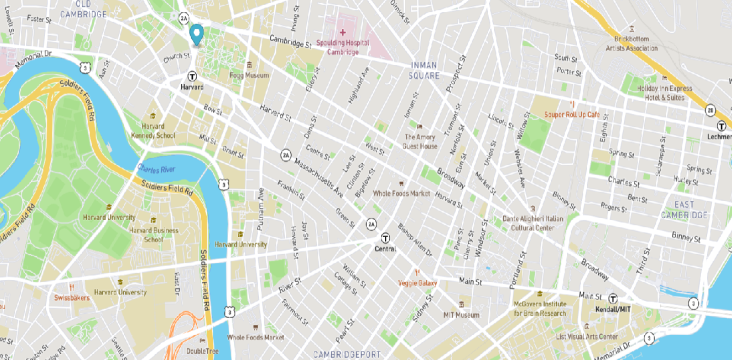

# Real-Time Bus Tracking Exercise

## This web page is an example of how to use JavaScript to (1) render a map on a web page and (2) build and manipulate maps on web pages.  

It's a good way to work with the DOM in JavaScript

Adding animation to maps, mapbox is an open-source platform 
that allows a user to create and display maps on a web page. 
The mapboxgl JavaScript library is part of the Mapbox ecosystem. 
It allows a user to add all sorts of customizations to the map.
Examples are: animated pointers, markers, and all sorts of things.

To be more specific, we used the MBTA bus data to determine stops between Harvard and MIT. We then, added an animated marker on the map to 
highlight the bus routes. 

How?
* (1) I created a Mapbox account and used the access token; 
* (2) I then added that access token to the mapboxgl instance
 defined in the mapanimation.js file; and 
* (3) Lastly, I created a marker and added it to the map using the 
mapboxgl pre-built functions
 
 The function move() is called when the button 
 "Show stops between MIT and Harvard" is selected. 
 This is how we start the marker animation. 
 
 When the code is executed, we see a marker moving from one bus stop to 
 the next on the map. 
 
 Installation: //opensourse //
25
​
26
    Usage: these files can be used to teach DOM, js manipuation, and mapbox
27
​
28
    Support: TBA
29
​
30
    Roadmap: TBA 
31
    
32
    License information: MIT License

Copyright (c) [2022-2023] [K. Artis-Mickens]

Permission is hereby granted, free of charge, to any person obtaining a copy
of this software and associated documentation files (the "Software"), to deal
in the Software without restriction, including without limitation the rights
to use, copy, modify, merge, publish, distribute, sublicense, and/or sell
copies of the Software, and to permit persons to whom the Software is
furnished to do so, subject to the following conditions:

The above copyright notice and this permission notice shall be included in all
copies or substantial portions of the Software.

THE SOFTWARE IS PROVIDED "AS IS", WITHOUT WARRANTY OF ANY KIND, EXPRESS OR
IMPLIED, INCLUDING BUT NOT LIMITED TO THE WARRANTIES OF MERCHANTABILITY,
FITNESS FOR A PARTICULAR PURPOSE AND NONINFRINGEMENT. IN NO EVENT SHALL THE
AUTHORS OR COPYRIGHT HOLDERS BE LIABLE FOR ANY CLAIM, DAMAGES OR OTHER
LIABILITY, WHETHER IN AN ACTION OF CONTRACT, TORT OR OTHERWISE, ARISING FROM,
OUT OF OR IN CONNECTION WITH THE SOFTWARE OR THE USE OR OTHER DEALINGS IN THE
SOFTWARE.
    
 
